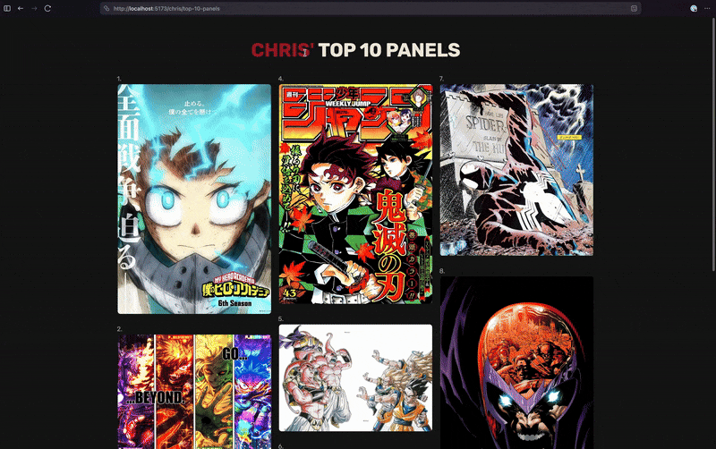
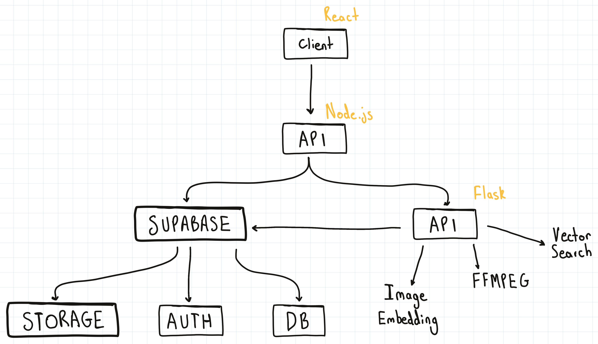

# Stackase

A full-stack web app where users curate, share, and explore manga and comic panels, with a focus on visual discovery.

## Overview

Stackase is a platform for showcasing, discovering, and exploring manga and comic panels, with AI-powered reverse image search to help users find new series and related artwork.

## Features

- AI-powered reverse image search using CLIP embeddings
- Organise content into collections and tags
- Authentication and user accounts
- Dockerised for easy self hosting

## Tech Stack

- Frontend: React, Tailwind
- Backend: Node.js / Flask
- Database: PostgreSQL
- Infrastructure: Docker, Docker Compose, Supabase
- Other: Redis

## Architecture

## Roadmap

- Improved search ranking
- Train AI model to identify characters and series from panels
- Add more social features
